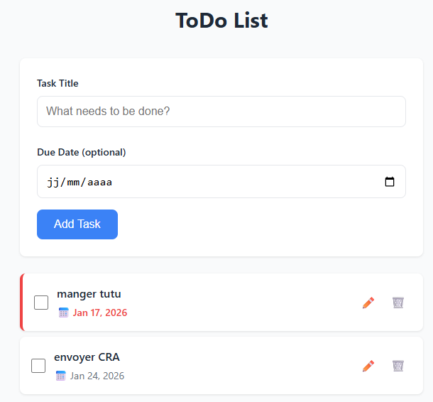
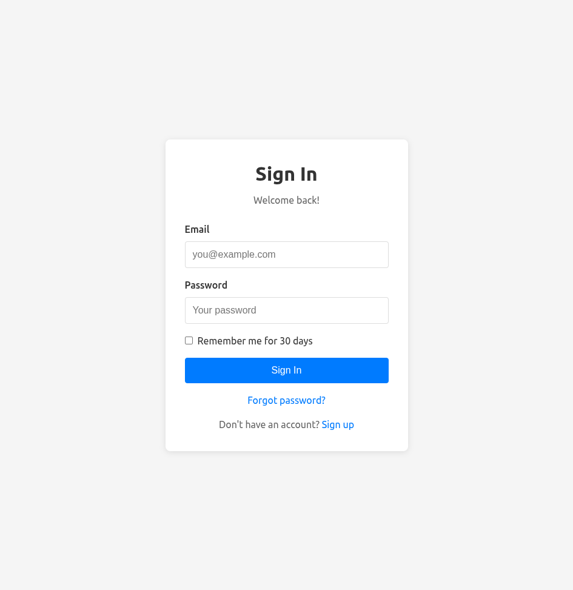
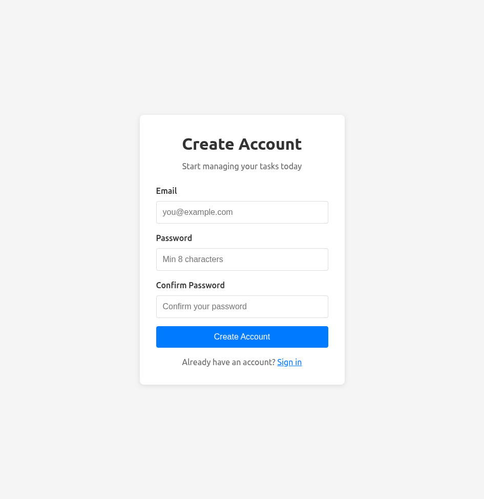
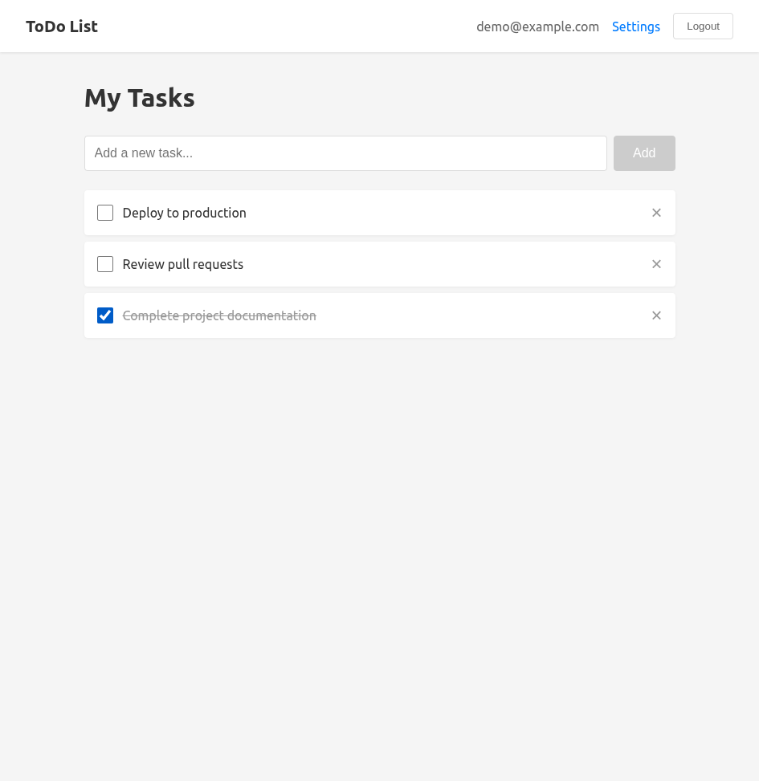
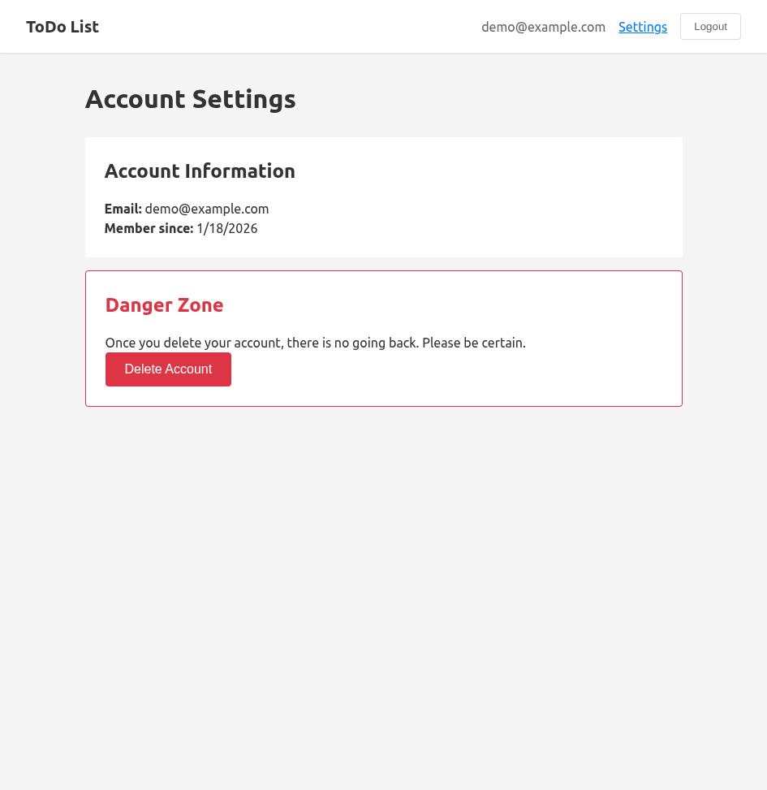

# hello-spec-kit

Spec-Driven Development of a ToDo List App

## Features

### 001 init

**Prompt used to generate the spec:**

> build an app to manage todo list of tasks. Tasks can have due date."

**Screenshots:**




### 002-multi-user-auth

Chapter genereted with this prompt :

```
update the README.md with a chapter named by the currenct spec folder name with prompt used in the generate spec.md and screenshoot of the current app. use MCP playright to do this 
```

**Prompt used to generate the spec:**

> "Create a new feature that allows multiple users to use the app. User must be identified first before accessing their own task list. The data must be accessible from any device."

**Overview:**

This feature adds multi-user authentication and cloud sync capabilities to the ToDo List app:

- User registration and login with email/password
- JWT-based authentication with secure refresh token rotation
- Password reset via email
- User-isolated task data (each user only sees their own tasks)
- Account management (change password, delete account)
- Cloud sync - access tasks from any device

**Tech Stack:**
- Backend: Express.js + TypeScript + SQLite (better-sqlite3)
- Frontend: React 19 + TypeScript + Vite
- Authentication: JWT access tokens + httpOnly cookie refresh tokens
- Password hashing: bcrypt

**Screenshots:**

| Login | Registration |
|:-----:|:------------:|
|  |  |

| Task List | Account Settings |
|:---------:|:----------------:|
|  |  |

**Running the app:**

```bash
# Backend (from /backend directory)
npm install
npm run dev  # Runs on http://localhost:3000

# Frontend (from /frontend directory)
npm install
npm run dev  # Runs on http://localhost:5173
```
